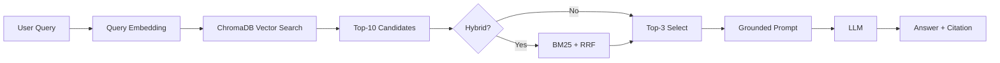

# Architecture — RAG Pipeline (Day 08 Lab)

## 1. Tổng quan kiến trúc

```
[Raw Docs]
    ↓
[index.py: Preprocess → Chunk → Embed → Store]
    ↓
[ChromaDB Vector Store]
    ↓
[rag_answer.py: Query → Retrieve → (Rerank) → Generate]
    ↓
[Grounded Answer + Citation]
```

**Mô tả:** Trợ lý nội bộ cho CS + IT Helpdesk; trả lời từ policy đã index, có trích dẫn và abstain khi không có bằng chứng.

## 2. Indexing Pipeline (Sprint 1)

### Tài liệu được index
| File | Nguồn (metadata) | Department | Ghi chú |
|------|------------------|------------|---------|
| `policy_refund_v4.txt` | policy/refund-v4.pdf | CS | Hoàn tiền |
| `sla_p1_2026.txt` | support/sla-p1-2026.pdf | IT | SLA P1 |
| `access_control_sop.txt` | it/access-control-sop.md | IT Security | Cấp quyền |
| `it_helpdesk_faq.txt` | support/helpdesk-faq.md | IT | FAQ |
| `hr_leave_policy.txt` | hr/leave-policy-2026.pdf | HR | Remote work |

### Quyết định chunking
| Tham số | Giá trị | Lý do |
|---------|---------|-------|
| Chunk size | ~400 tokens | Cân bằng ngữ cảnh vs độ dài context |
| Overlap | ~80 tokens | Giữ liền mạch giữa các chunk |
| Chiến lược | Section heading `===` + gom paragraph | Tránh cắt giữa điều khoản |
| Metadata | source, section, effective_date, department, access | Citation + lọc |

### Embedding model
- **Local:** `paraphrase-multilingual-MiniLM-L12-v2` (mặc định khi `EMBEDDING_PROVIDER=local`)
- **Cloud:** `text-embedding-3-small` khi `EMBEDDING_PROVIDER=openai`
- **Vector store:** ChromaDB PersistentClient, metric cosine

## 3. Retrieval Pipeline (Sprint 2 + 3)

### Baseline (Sprint 2)
| Tham số | Giá trị |
|---------|---------|
| Strategy | Dense |
| Top-k search | 10 |
| Top-k select | 3 |
| Rerank | Không |

### Variant (Sprint 3) — một biến đổi
| Tham số | Giá trị |
|---------|---------|
| Strategy | **Hybrid** (dense + BM25, RRF) |
| Top-k search / select | Giữ 10 / 3 |
| Rerank | Tắt (để A/B chỉ đo tác động hybrid) |

**Lý do:** Corpus có cả ngôn ngữ tự nhiên và từ khóa/alias (ví dụ “Approval Matrix” vs “Access Control SOP”); hybrid cải thiện recall nguồn đúng so với dense thuần.

## 4. Generation (Sprint 2)

- Prompt yêu cầu chỉ dùng context, trích dẫn `[n]`, và câu **Không đủ dữ liệu** khi không đủ bằng chứng.
- `temperature=0` cho ổn định khi eval.

## 5. Failure Mode Checklist

| Failure | Triệu chứng | Kiểm tra |
|---------|-------------|----------|
| Index | Sai version / thiếu doc | `list_chunks()`, metadata |
| Chunking | Cắt giữa điều khoản | Đọc preview chunk |
| Retrieval | Thiếu expected source | `score_context_recall` |
| Abstain | Hallucinate mã lỗi | Luật ERR-* + abstain |

## 6. Diagram


